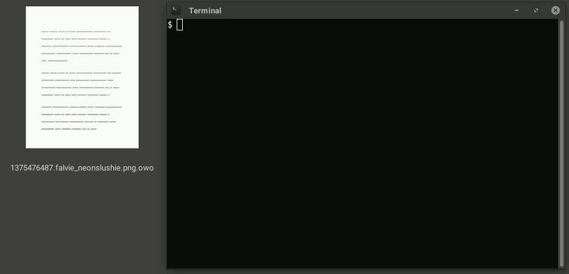

# owoencoder

`owoencoder` is a set of Python scripts that can convert any file into a series of `OwO` and `UwU` strings and convert it back.

**These scripts only support Python 3.** Python 2 will _not_ work. Python 2 has reached its EOL and is [no longer being developed](https://www.bleepingcomputer.com/news/software/python-27-reaches-end-of-life-after-20-years-of-development/).

## Syntax
More than one file can be specified on the command line. Wildcards also work if they are supported by your shell.

**To encode files:** `python [-kc] owoencode.py <original_file> [ ... ]>`  
Files will be encoded "in-place" meaning the originals will be removed. This is similar to `gzip` functionality.

**To decode a file:** `python [-kc] owodecode.py <encoded_file> [ ... ]`  
Similarly, files will be decoded "in-place" meaning the encoded file will be removed. Again, this mimics `gzip` functionality.

_Note: You can also execute the scripts directly_ (`./owoencode.py`) _if you have the executable bit set on them._

### Optional parameters
There are only two.

* `-k`: Keep the input file. Do not delete it after doing encoding or decoding.  
* `-c`: Encode or decode to `stdout` instead of a file. This implies `-k`. This also makes piping output possible.

## FAQ
### Why?
Why not?

### Why Python?
Good question.

### Do I have to download and install Python to use this?
On Windows, no. I have made executable versions of these scripts using [PyInstaller](https://www.pyinstaller.org/). You can grab them from the [Releases](https://github.com/glitchfur/owoencoder/releases) page. They bundle the Python interpreter and the script into one standalone `.exe` file. This has the added benefit that you can drag and drop any file onto `owoencode.exe` or `owodecode.exe`. As per the command syntax, the input file will be replaced with the output. You can select multiple files and drag them onto one of the `.exe`'s to encode or decode multiple files at once.

On Mac and Linux, you'll have to install Python, but if you're using one of these operating systems you're more likely to have it already anyway.

### What file types are supported?
You can encode and decode any type of file, whether it's a JPG or PNG image, a Word document, or that suspiciously large ZIP archive of your "2009 Tax Returns". However, I discourage trying to encode a file that is quite large to begin with (I'd say keep it under 100MB).

### How does this work?
Each bit of every byte in the original file is converted to either a `OwO` if the bit is `1`, or a `UwU` if the bit is `0`, and then it is written to the encoded file.

### Does this have any practical use?
Most likely, no.

### Why is the encoded file 24 times larger than the original?
Each byte in the original file is represented by 24 bytes in the encoded file. This is because every byte is converted to its binary representation, which becomes 8 bytes, and then each `1` or `0` is converted into a 3 character string, which is 3 bytes each. So `1 * 8 * 3 = 24`.

For example, the ASCII code for a lowercase `a` is `97`, which in binary is `01100001`, which in an encoded file would become `UwUOwOOwOUwUUwUUwUUwUOwO`. The letter `a` is obviously one character long. The encoded string is 24 characters long.

As previously stated, this encoder probably has no practical use and I do not expect it to be used in any real world situation where you'd need to encode something whatsoever, so I do not think that the significant size difference is that problematic. However, you can run the encoded file through another compression tool like `gzip` to get the file size down significantly.

### Doesn't this seem very inefficient?
In every possible way, yes.

Aside from the large file size problem discussed above, it's not exactly fast. On my CPU, encoding a 128MiB file containing pseudo-random data takes about a minute and a half. Decoding takes a full minute. For comparison, encoding the same file with `base64` takes 0.4 seconds, and decoding takes 1 second. This is why I don't encourage the idea of using these scripts with large files.

It could be related to the large file size problem, or it could be the fact that this is running in Python. But I mean, we're converting data to emotes here, so what do you expect?

## Examples

**Encoding a file, replacing the original:**  
`python owoencode.py example.jpg`

**Decoding a file, replacing the encoded one:**  
`python owodecode.py example.jpg.owo`

_The following examples require external programs._

Decoding an image to `stdout` and piping it to an image viewer such as `feh`:  
`python owodecode.py -c example.jpg.owo | feh -. -`

Decoding a music or video file to `stdout` to be played directly in VLC Media Player (also requires `netcat`):  
`python owodecode.py -c music.mp3.owo | nc -lp 1234`

Then you can open VLC, press **Ctrl+N** to open a Network Stream, and enter `tcp://127.0.0.1:1234`.

## License

This project is licensed under the [MIT License](LICENSE.txt).

## Bugs / Caveats

Encoding or decoding multiple files while writing to `stdout` (the `-c` switch) has not been tested. This will probably print out the encoded or decoded version of all the files you've specified as if you had run `cat` on all of them. Take care when doing this. It might only be acceptable when working with files that have been split into chunks.

If you discover any bugs, please let me know.

## Disclaimer

This was made just for fun and shouldn't be used as a legitimate method of encoding files. Do not use this on any files that are actually important to you. I am not responsible for the loss or damage of any files that may occur through the use of this tool. If you do decide to do this, then make backups.
